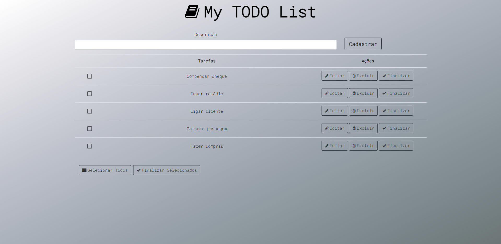
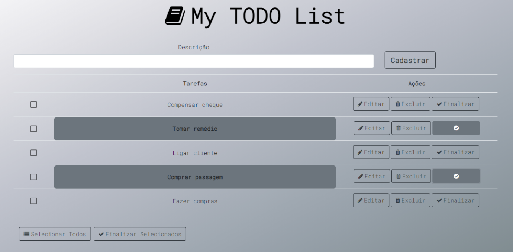

<h1 align="center">Dev-Test CI&T</h1>
<h1 align="center">

</h1>

 <a href="#-sobre-o-projeto">Sobre</a> •
 <a href="#-tecnologias">Tecnologias</a> •
 <a href="#-instalacao">Instalação</a> •
 <a href="#-layout">Layout</a> •  
 <a href="#-como-contribuir-para-o-projeto">Contribuir</a> •
 <a href="#-licença">Licença</a> •    

## 💻 Sobre o projeto
O presente projeto é uma proposta oferecida pela [CI&T](https://ciandt.com/br/pt-br/home) afim de desafiar os alunos da UNA em uma situação real de desenvolvimento front-end e back-end. 
O desafio consiste no desenvolvimento aplicação de lista de tarefas (todo list) aplicando conceitos REST e utilizando o formato JSON além de aplicar as funcionalidades solicitaidas.
A escolha de linguagem, framework, dependências e conceitos gerais de engenharia de software foi de livre escolha. 
Projeto desenvolvido durante a execução da unidade currícular de Gestão e Qualidade de Software oferecida pela faculdade [UNA](https://www.una.br/). 
Os requisitos completos do desafio pode ser verificado [aqui](https://github.com/dhiegobastos/dev-test).

### 🛠 Tecnologias

As seguintes ferramentas foram usadas na construção do projeto:

- [Node.js](https://nodejs.org/en/)
- [ReactJs](https://reactjs.org/)
- [Material.UI](https://material-ui.com/)
- [Docker](https://www.docker.com/)
- [Docker-Compose](https://docs.docker.com/compose/install/)
- [Axios](https://axios-http.com/)
- [Json-Server](https://www.npmjs.com/package/json-server)
- [Bootstrap](https://getbootstrap.com/)
- [FontAwesome](https://fontawesome.com/)

## 📋 Instalação

Necessário realizar a instalação do [Docker](https://www.docker.com/) e [Docker-Compose](https://docs.docker.com/compose/install/).

1. Clonar o repositório:

~~~
git clone https://github.com/rfaelfp/dev-test.git
~~~
2. Acessar o diretório do projeto pelo terminal:

~~~
./todolist
~~~
3.Instalar as dependencias executando:
~~~
npm i
~~~
4. Executar o comando:
~~~
docker-compose up
~~~

## 🎨 Layout

### Visão Geral

   
&nbsp;&nbsp;
  
&nbsp;&nbsp;

## 💪 Como contribuir para o projeto

1. Faça um **fork** do projeto.
2. Crie uma nova branch com as suas alterações: `git checkout -b my-feature`
3. Salve as alterações e crie uma mensagem de commit contando o que você fez: `git commit -m "feature: My new feature"`
4. Envie as suas alterações: `git push origin my-feature`
> Caso tenha alguma dúvida confira este [guia de como contribuir no GitHub](./CONTRIBUTING.md)

<h2 id=autor>:grin: Autor</h2>

Desenvolvido por 
<a href="https://www.linkedin.com/in/rafael-ferreira-pedrosa-021b16ba/" target="_blank">Rafael Ferreira Pedrosa</a>.

## 📝 Licença

Este projeto esta sobe a licença [MIT](./LICENSE).
